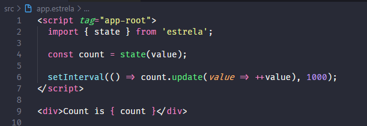
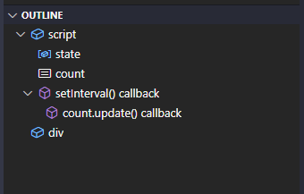

# estrela README

Highlight syntax for Estrela files.

## Features

This extension is a language service to create Estrela element files with ".estrela" extension. it is a fork of the [Svelte Language Service extension](https://github.com/sveltejs/language-tools.git).

Estrela file example:

VSCode outline tree:

<!-- ## Requirements

If you have any requirements or dependencies, add a section describing those and how to install and configure them.

## Extension Settings

Include if your extension adds any VS Code settings through the `contributes.configuration` extension point.

For example:

This extension contributes the following settings:

* `myExtension.enable`: enable/disable this extension
* `myExtension.thing`: set to `blah` to do something -->

## Known Issues

Typescript linting is not working yet. Will be fixed in the next releases.

## Release Notes

### 0.0.1

Initial release of Estrela extension.
